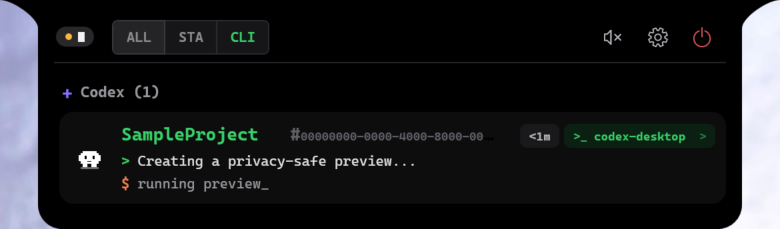

# CodeIsland for Windows

Real-time AI coding agent status panel for Windows, adapted from [wxtsky/CodeIsland](https://github.com/wxtsky/CodeIsland).

[Installation](#installation) · [Features](#features) · [Supported Tools](#supported-tools) · [Build](#build-from-source) · [简体中文](README.zh-CN.md)

---



## What is CodeIsland for Windows?

CodeIsland for Windows is a compact, always-on-top status panel for AI coding agents. It shows active sessions, tool calls, permission requests, questions, completion states, and errors without requiring you to keep switching back to a terminal or AI desktop app.

The interface is designed around a pure-black, pixel-style Windows island. Double-click to collapse it into a minimal status strip, drag it to any screen edge, or move it between monitors. Interactive requests automatically expand the panel so they are not missed.

This is a Windows adaptation of the original macOS [CodeIsland](https://github.com/wxtsky/CodeIsland). It is an independent port and is not an official Windows release of the upstream project.

## Features

- **Windows-native UI** — WPF desktop application with a frameless, always-on-top panel and system tray integration
- **Expanded and collapsed modes** — Double-click the panel to switch between the full session list and a compact pixel status strip
- **Live session tracking** — Displays session state, recent messages, active tools, elapsed time, and working context
- **Permission management** — Approve, deny, or always allow supported requests directly from the panel
- **Question answering** — Reply to agent questions without leaving the current application
- **Codex Desktop integration** — Opens the exact Codex conversation through its thread deep link
- **Codex transcript recovery** — Recovers active Codex sessions and follows live JSONL updates, including MCP/plugin calls
- **Pixel-art mascots** — Animated GIF characters with separate expanded and collapsed backgrounds
- **Drag-to-prioritize sessions** — Drag a session card up or down; the first active session is shown in collapsed mode
- **Multi-monitor docking** — Smoothly connects to all four edges of the monitor that currently contains the panel
- **Fullscreen awareness** — Hides only for a real fullscreen app on the same monitor
- **Dark themed controls** — Pixel-style settings, tray menu, action buttons, and scrollbars
- **Global shortcuts** — Configurable shortcuts for toggling the panel and resolving permission requests
- **Hook management** — Detect, install, repair, remove, and health-check supported agent hooks
- **Local IPC** — User-scoped Windows named pipes keep agent events on the local machine

## Supported Tools

Hook definitions are currently included for the following Windows tools:

| Tool | Session and tool events | Permission interaction | Jump target |
| --- | --- | --- | --- |
| Claude Code | Yes | Yes | Terminal/workspace |
| Codex | Yes, plus live transcript recovery | Yes | Codex Desktop thread or terminal |
| Gemini CLI | Yes | Notifications depend on CLI hook support | Terminal/workspace |
| Cursor | Yes | Hook-dependent | IDE/workspace |
| Qoder | Yes | Yes | IDE/workspace |
| Factory Droid | Yes | Yes | Terminal/workspace |
| CodeBuddy | Yes | Yes | App/terminal |
| GitHub Copilot CLI | Yes | Hook-dependent | Terminal/workspace |

Event coverage depends on the hook API exposed by each tool and may vary between tool versions.

## Installation

### Release package

1. Download `CodeIsland-Windows-0.1.0-win-x64.zip` from the release artifacts.
2. Extract the entire ZIP to a permanent folder.
3. Run `CodeIsland.Windows.exe`.
4. Open **Settings → Hooks**, then install or repair the hooks for the detected tools.

> Do not copy only the EXE. CodeIsland is framework-dependent and requires the DLL, runtime configuration, bridge executable, icons, and GIF assets included beside it.

### Requirements

- Windows 10 or Windows 11, x64
- [.NET 8 Desktop Runtime](https://dotnet.microsoft.com/download/dotnet/8.0)
- At least one supported AI coding tool for live session events

Windows SmartScreen may warn about an unsigned build on first launch. Verify the package source and checksum before running it.

## How It Works

```text
AI coding tool
    → CodeIsland hook or Codex JSONL transcript
    → CodeIsland.Bridge
    → user-scoped Windows named pipe
    → CodeIsland.Windows
    → live session state and interactive controls
```

Hooks normalize agent-specific payloads into a shared event model. The bridge forwards those events through a named pipe secured to the current Windows user. The desktop application updates its state machine and, for supported permission or question events, returns the selected action to the calling agent.

Codex Desktop receives additional support through live session transcript recovery. Function calls, custom tools, and MCP/plugin completion events are reflected in the panel even when no traditional CLI hook is available.

## Settings

The custom dark settings window includes:

- **General** — Language, startup behavior, and preferred display
- **Behavior** — Session cleanup and fullscreen hiding
- **Appearance** — Visible session and event history limits
- **Sound** — Event notification sounds
- **Hooks** — Tool discovery, installation, repair, removal, and health status
- **Shortcuts** — Configurable global keyboard shortcuts
- **About** — Version and application information

## Keyboard Shortcuts

| Action | Default |
| --- | --- |
| Toggle expanded/collapsed panel | `Ctrl+Shift+I` |
| Approve current permission request | `Ctrl+Shift+A` |
| Deny current permission request | `Ctrl+Shift+D` |

Shortcuts can be changed under **Settings → Shortcuts**.

## Build from Source

Requires the .NET 8 SDK specified by `global.json`.

```powershell
# Run from an existing source checkout
cd CodexStatus
dotnet build CodeIsland.Windows.sln -c Release
dotnet run --project CodeIsland.Windows\CodeIsland.Windows.csproj
```

Run the smoke suite:

```powershell
dotnet run --project CodeIsland.Windows.Smoke\CodeIsland.Windows.Smoke.csproj -c Release
```

Create the Windows release ZIP:

```powershell
powershell.exe -NoProfile -ExecutionPolicy Bypass -File .\scripts\build-release.ps1
```

The generated package and SHA-256 manifest are written to `artifacts/`.

## Project Structure

| Project | Responsibility |
| --- | --- |
| `CodeIsland.Windows` | WPF UI, tray integration, settings, session display, Codex transcript tailing |
| `CodeIsland.Core` | Shared event model and session state machine |
| `CodeIsland.Protocol` | Agent payload normalization and Codex transcript parsing |
| `CodeIsland.Ipc` | User-scoped Windows named-pipe transport |
| `CodeIsland.Hooks` | Supported tool definitions and hook configuration |
| `CodeIsland.Bridge` | Hook-to-application event bridge |
| `CodeIsland.Windows.Smoke` | End-to-end smoke checks |

## Acknowledgments

This project is adapted from [wxtsky/CodeIsland](https://github.com/wxtsky/CodeIsland), which created the original real-time AI coding agent panel for the macOS notch. Many thanks to [@wxtsky](https://github.com/wxtsky) and all upstream contributors for the product concept, interaction model, pixel-art direction, and open-source implementation that made this Windows port possible.

Please visit and support the original project if you use or build on this adaptation.

## License

MIT License. When redistributing this adaptation, retain the notices required by this project and its upstream dependencies.
